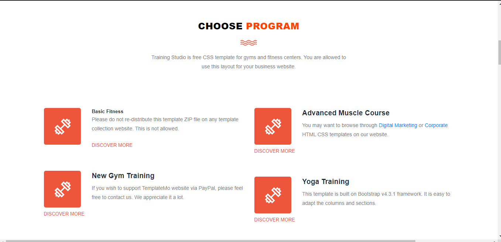
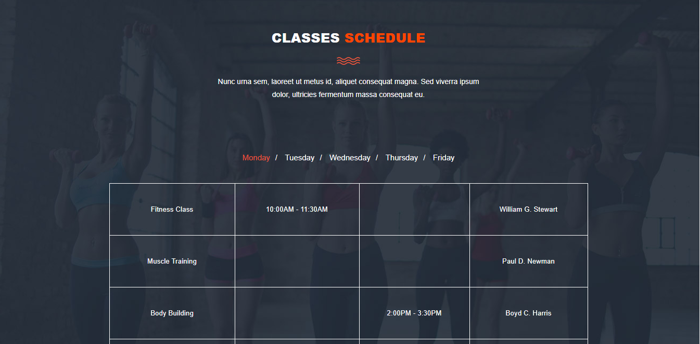

> This is Static Trainigworkout website which is developed just for learning pursose. It was a small Assesment which was assigned to me for completion within the time.

> The content may vary to any other site but i dibn't use for any Commercial purposes. it is  just used for task only.

## How to run (Steps)

```
1. git clone https://github.com/anil-pradhan143/gym
2. Run index.html file on browser

```

## Screenshots : 

1. Section 1 :

<p align="center">
  <!--  -->
  
</p>

2. Section 2:

<p align="center">
  <!--  -->
  
</p>


3. Section 3 :

<p align="center">
  
</p>

4. Section 4 :

<p align="center">
  
</p>

5. Section 5 :

<p align="center">
  
</p>

6. Section 6 :

<p align="center">
  
</p>


7. Section 7 :

<p align="center">
  
</p>


